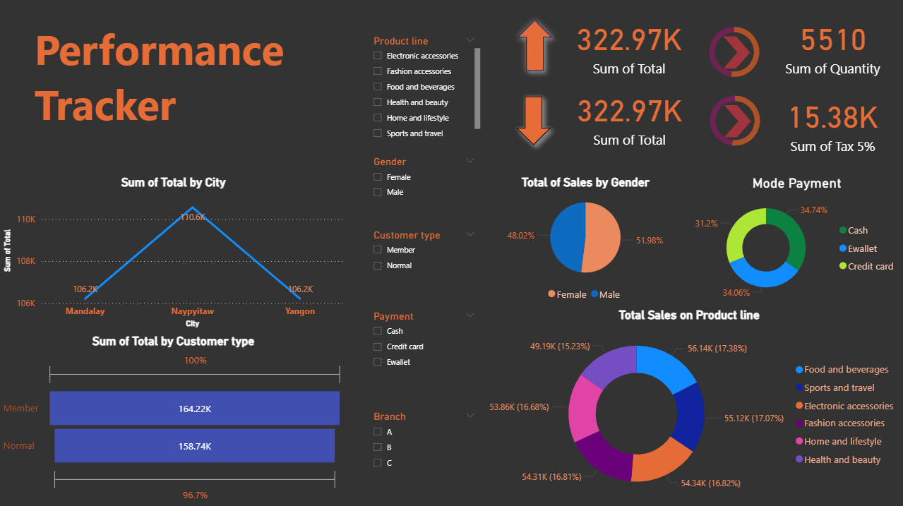

# 📊 Power BI Dashboard Project

## 📌 Overview
This project showcases an interactive Power BI dashboard built using a clean dataset to analyze and visualize key insights. The dashboard is designed to provide clear and meaningful business insights through effective data visualization.

---

## 🎯 Objectives
- To create an interactive and user-friendly dashboard  
- To visualize data for better understanding and decision-making  
- To highlight important trends and patterns in the dataset  

---

## 🛠 Tools & Technologies
- Power BI  
- Excel / CSV Dataset  
- Data Visualization Techniques  

---

## 📷 Dashboard Preview

  
  

---

## 📊 Key Features
- Interactive filters and slicers  
- Clear and structured visual layout  
- Dynamic charts and KPIs  
- Easy-to-understand insights  

---

## 📈 Key Insights
- Identified trends and patterns in the dataset  
- Compared performance across categories/regions  
- Highlighted important metrics using visual elements  

---

## 🚀 How to Use
1. Download the `.pbix` file  
2. Open it using Power BI Desktop  
3. Explore the dashboard using filters and visuals  

---

## 🔗 Author
**Kanika S**  

---

## ⭐ Feedback
Feel free to share your feedback or suggestions to improve this project!
